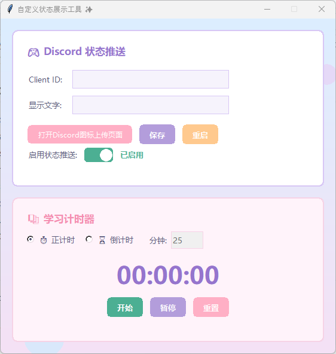

<p align="right">
  <strong>English</strong> |
  <a href="./README.zh-CN.md">简体中文</a>
</p>

# Discord Status DIY

A small desktop tool for creating your own Discord Rich Presence status.

You can use it to display a custom “Playing …” status on Discord without connecting it to a real game. It also comes with a simple local study timer for keeping track of focused work sessions.

The interface is built with Python and Tkinter.

## Download

### Windows

[](https://github.com/KianaShi/Discord_Status_DIY/releases/latest/download/DiscordStatusDIY.exe)

Download the `.exe` file and open it directly.

Python is not required when using the Windows executable.

> Windows may show a security warning because the application is not digitally signed. If you downloaded it from this repository, you can select **More info → Run anyway**.

## What It Does

* Displays a custom Discord Rich Presence status
* Lets you change the displayed activity text
* Saves your settings locally
* Lets you temporarily disable Discord status updates
* Includes a stopwatch
* Includes a countdown timer
* Runs without opening a command-line window
* Keeps the Discord integration separate from the timer

## Preview

You can add a screenshot of the application here:

```markdown

```

Suggested project structure:

```text
assets/
└── app-preview.png
```

## Using the Windows App

1. Download `DiscordStatusDIY.exe` from the Releases page.
2. Open the Discord desktop application and sign in.
3. Run `DiscordStatusDIY.exe`.
4. Enter your Discord Application ID.
5. Enter the text you want to display.
6. Save the settings and restart the application.

The study timer can be used even when Discord is not connected.

## Discord Setup

### 1. Create a Discord Application

Go to the [Discord Developer Portal](https://discord.com/developers/applications) and create a new application.

Open the application and copy its **Application ID**.

Discord may also refer to this value as the **Client ID**.

### 2. Keep Discord Open

Discord Rich Presence communicates with the Discord desktop client running on your computer.

Make sure the desktop version of Discord is open and that you are signed in.

The browser version of Discord is not enough for Rich Presence.

### 3. Enter Your Application ID

Open Discord Status DIY and paste your Application ID into the App ID field.

Then enter the custom status text you want to display.

You can either:

* Click **Save** to store the settings
* Click **Restart** to save the settings and restart the application immediately

Saved settings take effect after the application restarts.

## Custom Images

The application includes a shortcut to the Discord asset management page for your Application ID.

In the Discord Developer Portal, open:

```text
Rich Presence → Art Assets
```

You can upload a custom image for your Discord application.

Recommended image format:

* PNG
* Square image
* Around `512 × 512` pixels
* Static image instead of GIF

The current version mainly sends custom status text. The asset-page button is included as a convenient shortcut for managing images in the Discord Developer Portal.

## Enable Status Updates

The **Enable Status Updates** option controls whether the application tries to connect to Discord when it starts.

When this option is turned off:

* The application will not connect to Discord
* Your saved App ID and status text will remain available
* The local study timer will continue to work

This is useful when you want to pause your custom Discord status without deleting your settings.

## Leaving the App ID Empty

The application can still open without an Application ID.

It will not attempt to connect to Discord, and the connection status will remain inactive.

This is normal and does not mean the application has crashed.

The study timer will still work normally.

## Study Timer

The timer is completely local and does not depend on Discord.

It supports two modes:

### Stopwatch

Counts upward from zero.

This can be used to track how long you have been studying or working.

### Countdown

Counts down from a number of minutes selected by the user.

The timer includes:

* Start
* Pause
* Reset

## Run from Source

To run the project from source, make sure Python is installed.

Clone the repository:

```bash
git clone https://github.com/KianaShi/Discord_Status_DIY.git
cd Discord_Status_DIY
```

Install the required packages:

```bash
pip install -r requirements.txt
```

Run the application:

```bash
python main.py
```

On Windows, you can also double-click:

```text
start.bat
```

The batch file starts the application with `pythonw`, so a console window will not stay open in the background.

## Project Structure

```text
Discord_Status_DIY/
├── main.py
├── ui_theme.py
├── timer_widget.py
├── start.bat
├── requirements.txt
├── config.example.json
├── providers/
│   ├── base.py
│   └── discord_provider.py
├── README.md
└── README.zh-CN.md
```

### Files

| File                            | Purpose                                                |
| ------------------------------- | ------------------------------------------------------ |
| `main.py`                       | Main application window and program entry point        |
| `ui_theme.py`                   | Colors, layout settings, and custom Tkinter components |
| `timer_widget.py`               | Stopwatch and countdown timer                          |
| `providers/base.py`             | Base interface for status providers                    |
| `providers/discord_provider.py` | Discord Rich Presence connection                       |
| `config.example.json`           | Example configuration file                             |
| `start.bat`                     | Windows launcher using `pythonw`                       |
| `README.md`                     | English documentation                                  |
| `README.zh-CN.md`               | Chinese documentation                                  |

## Configuration

The application stores local settings in:

```text
config.json
```

You do not need to create this file before opening the application.

If the file does not exist, the application will start with an empty default configuration.

A sample configuration is provided in:

```text
config.example.json
```

You can copy and rename it if you prefer to create the configuration manually:

```text
config.example.json → config.json
```

## Privacy

The repository does not contain your personal Discord credentials.

The local `config.json` file is excluded through `.gitignore`, so it should not be uploaded to GitHub.

Each user needs to create and use their own Discord Application ID.

The application does not connect to a remote database or send configuration data to a separate server.

## Adding Another Platform

The project uses a small provider interface so that other status platforms can be added later.

The base interface is located in:

```text
providers/base.py
```

A provider can implement methods such as:

```text
connect
update_status
clear_status
close
```

The Discord implementation can be found in:

```text
providers/discord_provider.py
```

This keeps most platform-specific logic outside the main interface code.

## Building the Windows Executable

Install PyInstaller:

```bash
pip install pyinstaller
```

Build the executable:

```bash
pyinstaller --noconfirm --clean --onefile --windowed --name DiscordStatusDIY main.py
```

The generated file will appear in:

```text
dist/DiscordStatusDIY.exe
```

You can upload that file to a GitHub Release.

For the README download link to work, keep the uploaded filename exactly as:

```text
DiscordStatusDIY.exe
```

## Current Limitations

* Only support Chinese in app
* Discord desktop must be running for Rich Presence to work
* The executable is not digitally signed
* Discord may take a few seconds to update the status
* Changes to saved settings require an application restart
* The current version focuses mainly on custom status text
* The application is primarily designed for Windows

## Why I Made This

This is a small personal project made to explore:

* Discord Rich Presence
* Desktop GUI development with Tkinter
* Local configuration management
* Simple provider-based application structure
* Packaging Python applications as Windows executables

It is also a tool I wanted to use myself while studying.

## License

This project is currently shared for personal and educational use.

You can add an MIT License later if you want to clearly allow other people to reuse, modify, and distribute the code.

## Author

Created by [Kiana Shi](https://github.com/KianaShi).
